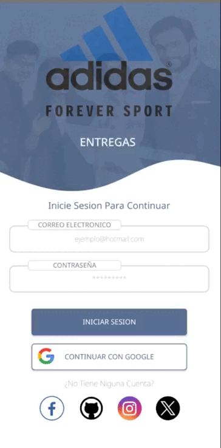
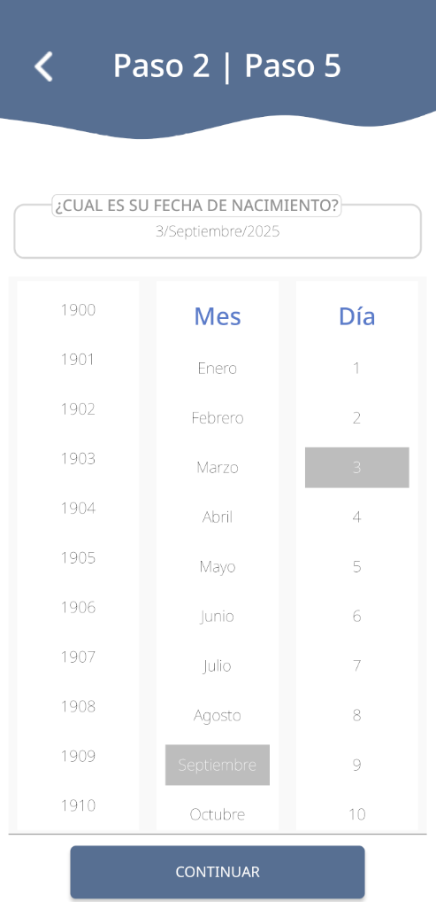
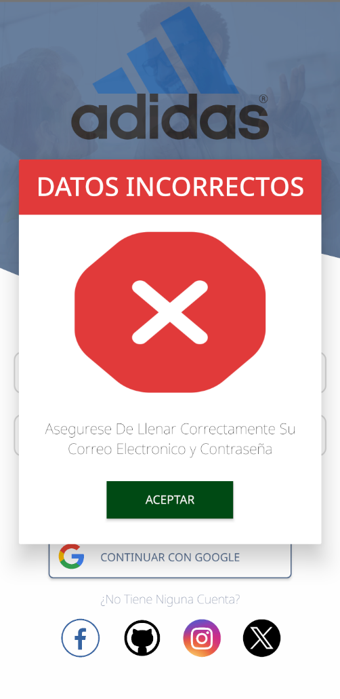

<!--proyect_tittle-->
# 📱 Android App for Client–Supplier Communication

<!--proyect_image1_proyect_markdown/image1.gif-->

---

<!--proyect_subtitle_description-->
## ✨ Project Description

<!--proyect_content_description-->
This project involves the development of an **Android mobile application** focused on enabling direct communication between clients and suppliers. The app allows users to log in, register new accounts, and validate access—all within a modern and responsive interface.

Currently, the application is under development, running on an **Android emulator** with control via **ADB**, and managed using **Gradle** as the build system. The backend is not yet implemented, but it is planned to be built with **Node.js**, which will enable features such as messaging, data synchronization, and request management.

---

<!--proyect_subtitle_objective-->
## 🎯 Project Objective

<!--proyect_content_objective-->
The main goal is to create an **efficient and secure mobile platform** that allows suppliers to interact with their clients, respond to requests, share information, and maintain a communication history from any Android device.

The app aims to replace traditional channels like email or phone calls, offering a centralized, traceable, and professional experience.

---

<!--proyect_subtitle_functionality-->
## 🧩 General Functionality

<!--proyect_content_functionality-->
The app is composed of the following key modules:

1. **Login:** Users can enter their credentials to access a personalized dashboard.
2. **Supplier Registration:** A guided form captures data such as name, company, contact info, and credentials.
3. **Access Validation:** The system verifies submitted data and displays visual confirmation of session status.

In future versions, a backend will be integrated to enable features such as messaging, notifications, request management, and real-time synchronization.

<!--proyect_image2_proyect_markdown/image2.png-->

---

<!--proyect_subtitle_designUX-->
## 🖥️ Design and User Experience

<!--proyect_content_designUX-->
The interface is designed to be clean, modern, and responsive. It uses native Android components with intuitive navigation, accessible forms, and visual feedback at every step. The design adapts to various screen sizes, ensuring a smooth experience on both emulators and physical devices.

The user flow is optimized to reduce friction, and each action is accompanied by status messages that inform users of progress and validation.

<!--proyect_image3_proyect_markdown/image3.png-->

---

<!--proyect_subtitle_architecture-->
## 🏗️ Technical Architecture

<!--proyect_content_architecture-->
The app is built on a modular and scalable architecture:

- **Mobile frontend:** Developed in Android using Gradle as the build system.
- **Emulation and testing:** Uses Android Emulator and ADB for debugging and validation.
- **View management:** Activities and fragments organized by user flow.
- **Backend (planned):** Node.js with RESTful API for authentication, messaging, and synchronization.
- **Local persistence:** Uses SharedPreferences and temporary structures to simulate sessions.

---

<!--proyect_subtitle_technologies-->
## 🔧 Technologies Used

<!--proyect_content_technologies-->
**Mobile frontend:**
- Android Studio  
- Gradle  
- XML for layouts  
- Kotlin / Java (depending on module)

**Development tools:**
- Android Emulator  
- ADB (Android Debug Bridge)  

**Backend (planned):**
- Node.js  
- Express.js  
- MongoDB or SQL (to be defined)

---

<!--proyect_subtitle_contact-->
## 📬 Contact

<!--proyect_content_contact-->
**Email:**
- vielmassalais023@gmail.com  

**Phone:**
- +52 (81) 3233-1206  

**Social Media:**
- GitHub: [@CesarVielmas](https://github.com/CesarVielmas)  
- LinkedIn: [Cesar Vielmas](https://www.linkedin.com/in/cesar-vielmas-324a9b218/)  

---

<!--proyect_subtitle_footer-->
## Client–Supplier App

<!--proyect_content_footer-->
Connecting businesses through Android with efficiency and mobile vision 📱  
**Last updated:** September 2, 2025
